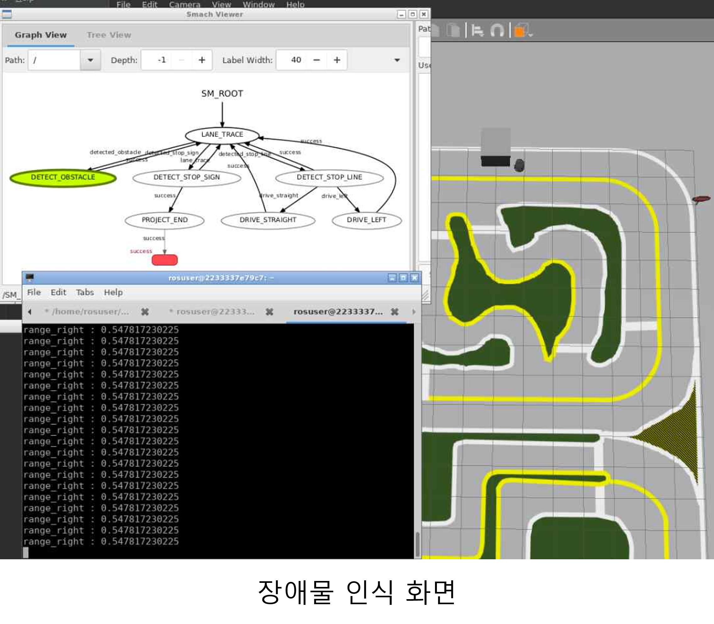

# 2021년도 3학년 2학기 객체지향모델링
<h2 align=left>합반 2조 ROS 기반의 터틀봇 자율주행</h2>

## 목차

1. [배경](#1-배경)
2. [개발 환경](#2-개발-환경)
3. [주요 기능](#3-주요-기능)
4. [사용법](#4-사용법)
5. [발표 영상](#5-발표-영상)
6. [데모 영상](#6-데모-영상)
7. [팀원](#7-팀원)

## 1. 배경

&nbsp;자율주행은 '인간이 운전하는 것보다 안전한 운전'을 목표로 하는 기술로, 차량 사고를 줄여주어 운행의 안정성을 높여준다. 또한, 전동화를 통해 차의 부품 수가 줄어들어 고장률도 줄어들고, 호텔 산업, 승차 공유 산업, 항공 산업, 부동산 산업 등 우리 생활 전반에 영향을 미칠 것이다.

&nbsp; 실제 차량을 이용한 자율 주행 테스트는 위험성이 높고 비용적인 부담이 되기 때문에 본 프로젝트는 ROS 프레임워크를 사용하여 터틀봇을 사용한 자율 주행 환경을 제공한다.

## 2. 개발 환경

```
* OS : Ubuntu 18.04 LTS
* Programming Language : Python2.7
* IDE : Pycharm 2.7.17
* Framework : Ros melodic
* Library : OpenCV
* Version control : Docker, Git
```

## 3. 주요 기능

1. 차단바 인식</br>
입력 영상에서 차단바를 인식하면 4초간 정지한다.  <br/><br/>


2. 정지선 인식 및 정지</br>
Image에 대한 마스킹을 진행하여 정지선을 검출하고, 터틀봇을 3초간 정지시킨다.  <br/><br/>


3. 차선 인식 및 추적</br>
Canny 알고리즘을 사용하여 차선을 인식하고, 인식되는 차선에 따라 주행 방향을 설정한다.  <br/><br/>


4. 정지 표지판 인식 및 정지</br>
정지 표지판의 윤곽선을 검출하여 터틀봇을 3초간 정지시킨다.  <br/><br/>


5. 장애물 인식 및 정지</br>
LaserScan을 사용하여 전방에 장애물이 있는지 스캔하고, 인식되면 터틀봇을 정지시킨다.  <br/><br/>


## 4. 사용법

터틀봇에 좌, 우 카메라 추가  
[kobuki.urdf.xacro](https://github.com/ads0070/deu_car/blob/master/kobuki.urdf.xacro) 참고
```
$ cd ~/catkin_ws/src/kobuki_description/urdf
$ gedit kobuki.urdf.xacro
$ cd ~/catkin_ws
$ catkin_make
```

launch 파일 및 car_state_machine.py 실행

```
$ roscd deu_car
$ source ./gazebo_env.sh
$ chmod +x ./scripts/blocking_bar_control.sh
$ chmod +x ./scripts/obstacle_spawn.py
$ roslaunch deu_car car_test.launch
$ rosrun deu_car car_state_machine.py
```

차선 변경 방법
```
* launch 파일과 car_state_machine.py 실행 후 터미널에 1 또는 2 입력
* 1 : 1차선 주행 시작
* 2 : 2차선으로 이동 후 주행 시작
```

## 5. 발표 영상

[](https://youtu.be/ZHMupwaDdGE)

## 6. 데모 영상

[](https://youtu.be/Jb6omYSgUpM)

## 7. 팀원
- 20173217 안대현
- 20194152 허세진
- 20173176 박진우
- 20153294 김두영


<a href="https://github.com/ads0070" title="20173217 안대현">
</a>

<a href="https://github.com/Heosejin98" title="20194152 허세진">
</a>

<a href="https://github.com/014787410"  title="20173176 박진우">
</a>
